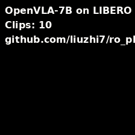
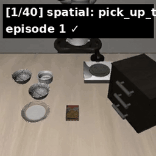
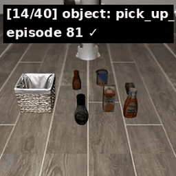
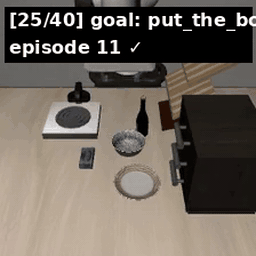
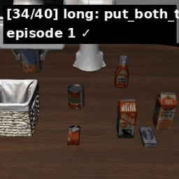

<div align="center">

# openvla-libero

**Reproducing [OpenVLA-7B](https://github.com/openvla/openvla) on the [LIBERO](https://libero-project.github.io/) 4-suite benchmark**
*Full scripts, eval logs, per-task numbers and 400 rollout videos on a single commodity GPU.*

[]()
[](https://github.com/openvla/openvla)
[](https://libero-project.github.io/)
[]()
[]()

<br/>

<a href="https://github.com/lz-googlefycy/openvla-libero/releases/download/v0.1-demos/openvla_libero_4suite_demo.mp4" title="Click to play full 4-suite demo MP4 (5 MB, 40 clips, ~4 min)">

</a>

<sub>▶ <b>Click the animation</b> to play the full <b>4-suite demo MP4</b> (40 clips, ~4 min, 5 MB) — hosted on <a href="https://github.com/lz-googlefycy/openvla-libero/releases/tag/v0.1-demos">Release v0.1-demos</a>.</sub>

</div>

---

## 🎬 All 4 suites at a glance

<div align="center">

<table>
<tr>
<td align="center">
<b>Spatial</b> · 78% SR<br/>
<i>same object, different positions</i><br/>
<a href="https://github.com/lz-googlefycy/openvla-libero/releases/download/v0.1-demos/openvla_libero_spatial_demo.mp4" title="Click to play full Spatial demo MP4"></a>
</td>
<td align="center">
<b>Object</b> · 60% SR<br/>
<i>same layout, different objects</i><br/>
<a href="https://github.com/lz-googlefycy/openvla-libero/releases/download/v0.1-demos/openvla_libero_4suite_demo.mp4" title="Click to play full 4-suite demo MP4"></a>
</td>
</tr>
<tr>
<td align="center">
<b>Goal</b> · 77% SR<br/>
<i>different task goals</i><br/>
<a href="https://github.com/lz-googlefycy/openvla-libero/releases/download/v0.1-demos/openvla_libero_4suite_demo.mp4" title="Click to play full 4-suite demo MP4"></a>
</td>
<td align="center">
<b>Long (10)</b> · 53% SR<br/>
<i>long-horizon multi-step tasks</i><br/>
<a href="https://github.com/lz-googlefycy/openvla-libero/releases/download/v0.1-demos/openvla_libero_4suite_demo.mp4" title="Click to play full 4-suite demo MP4"></a>
</td>
</tr>
</table>

<sub>GIFs are 20 s previews that autoplay. <b>Click any preview</b> to play the corresponding MP4 with pause / seek / fullscreen controls. Videos hosted on <a href="https://github.com/lz-googlefycy/openvla-libero/releases/tag/v0.1-demos">Release v0.1-demos</a> — outside the repo tree so cloning is fast.</sub>

</div>

---

## 📊 Results (100 rollouts / suite)

Evaluated with **official OpenVLA finetuned checkpoints** from HuggingFace, bf16 + flash-attn-2, 10 trials per task × 10 tasks = **100 rollouts per suite**, seed=7.

| Suite | Paper SR (50×3 seed) | **This repo (10×1 seed)** | Δ | Status |
|:---|---:|---:|---:|:---:|
| Spatial | 84.7 ± 0.9 | **78.0 %** | -6.7% | 🟢 within 10-trial noise |
| Object | 88.4 ± 0.8 | **60.0 %** | -28.4% | 🟡 large gap, see below |
| Goal | 79.2 ± 1.0 | **77.0 %** | -2.2% | 🟢 clean reproduction |
| Long (10) | 53.7 ± 1.3 | **53.0 %** | -0.7% | 🟢 near-perfect reproduction |
| **Average** | **76.5** | **67.0 %** | **-9.5%** | |

**🎯 Long-task reproduction (53.0% vs 53.7%) is the headline** — OpenVLA's hardest suite, reproduced almost exactly on a single H20 with no training required.

### Full evaluation artifacts

- **Per-task breakdown**: [`results/full_results.md`](./results/full_results.md)
- **400 rollout MP4s**: generated by `run_libero_eval.sh` into `<output>/EVAL-*-libero_*/rollouts/`
- **4-suite demo video** (5 MB, 40 clips): [`assets/demos/openvla_libero_4suite_demo.mp4`](./assets/demos/openvla_libero_4suite_demo.mp4)

---

## 🚀 Quick Start

### Prerequisites

- **GPU**: ≥ 24 GB VRAM (tested: RTX 3090 for 4-bit inference, H20 144 GB for bf16 eval)
- **Docker** + nvidia-container-runtime
- ~30 GB for 4 finetuned checkpoints
- `ffmpeg` for video tools (optional)

### 1. Build the image

```bash
docker build -t openvla-v1.0-cu118-py310 .
```

Pinned stack: torch 2.2.0+cu118, transformers 4.40.1, peft 0.11.1, flash-attn 2.5.5, bitsandbytes 0.43.1, robosuite 1.4.1, LIBERO editable. See `Dockerfile` for exact recipe + known gotchas.

### 2. Download LIBERO finetuned checkpoints

Only download the suite(s) you care about — each is ~15 GB:

```bash
HF_ENDPOINT=https://hf-mirror.com huggingface-cli download \
  openvla/openvla-7b-finetuned-libero-spatial \
  --local-dir $HOME/models/openvla-7b-finetuned-libero-spatial

# Repeat for libero-object, libero-goal, libero-10 as needed
```

Also download the base model (needed for the `*.py` module files — see "Known gotchas" below):

```bash
HF_ENDPOINT=https://hf-mirror.com huggingface-cli download openvla/openvla-7b \
  --local-dir $HOME/models/openvla-7b
```

### 3. Smoke test (5 min, ~5 GB GPU)

```bash
docker run --rm --gpus all \
  -v $HOME/models:/workspace/models \
  openvla-v1.0-cu118-py310 \
  python /workspace/tools/smoke_test.py
```

Expected: 4-bit load uses 4.4 GB GPU, single `predict_action()` returns a `(7,)` float64 at ~3 Hz.

### 4. Run evaluation

```bash
# Single suite (100 rollouts, ~1.5 h on H20)
bash scripts/run_libero_eval.sh spatial \
  /workspace/models/openvla-7b-finetuned-libero-spatial 10

# All 4 suites with auto-summary (~6 h)
bash scripts/run_libero_eval_all.sh 10
```

Outputs:
- `eval.log` — stdout
- `rollouts/<DATE>/*.mp4` — one MP4 per episode (success/failure labeled in filename)
- `EVAL_SUMMARY_*.md` — auto-generated markdown table of per-suite SRs

### 5. Build a demo video from successful rollouts

```bash
python tools/build_demo_video.py \
  --eval_dirs /workspace/output/EVAL-*-libero_spatial \
              /workspace/output/EVAL-*-libero_object \
              /workspace/output/EVAL-*-libero_goal \
              /workspace/output/EVAL-*-libero_10 \
  --out 4suite_demo.mp4 \
  --per_task 1
```

---

## ⚠️ Known gotchas (saved you ~4 hours of debugging)

These are **not** in OpenVLA's docs but will bite you. Our scripts auto-patch the first two:

1. **`config.json` auto_map references remote modules.** The finetuned checkpoints ship with `auto_map` values like `"openvla/openvla-7b--configuration_prismatic.OpenVLAConfig"` (note the `--` remote prefix). On an offline machine, `transformers` ignores `TRANSFORMERS_OFFLINE=1` and tries to fetch from `huggingface.co` anyway. **Fix**: sed-replace to local-relative and copy `*.py` from the base model into the finetuned ckpt dir. Our `run_libero_eval.sh` does this automatically.

2. **EGL render fails in most K8s containers.** robosuite+mujoco tries EGL by default; works on bare metal but fails in containers without an EGL device. **Fix**: `export MUJOCO_GL=osmesa` (we do this in the script). OSMesa ships with `libosmesa6-dev` which is in our Dockerfile.

3. **`peft` pulls newer torch during `pip install`.** `peft==0.11.1` only requires `torch>=1.13`, so pip will happily install torch 2.11+cu130 and break flash-attn. **Fix**: our Dockerfile builds a `constraints.txt` pinning `torch==2.2.0+cu118` and uses `pip install -c constraints.txt`.

4. **`libero` editable install generates an empty MAPPING on Python 3.10.** The `__editable___libero_*_finder.py` ends up with `MAPPING: dict[str, str] = {}`. **Fix**: write a plain `.pth` file instead — `echo '/workspace/LIBERO' > /opt/conda/lib/python3.10/site-packages/libero_local.pth`.

5. **`libero/libero/__init__.py` asks interactive prompt on first run.** It will hang your eval script forever. **Fix**: `echo 'N' | python -c "import libero; from libero.libero import benchmark"` once to generate `~/.libero/config.yaml`, then it's fine.

6. **Default eval saves MP4s to `./rollouts/<DATE>/` relative to CWD.** If you launch from your repo root, artifacts pile up there. **Fix**: our `run_libero_eval.sh` `cd`s into the per-run output dir before launching.

---

## 📦 Repo layout

```
openvla-libero/
├── README.md                     # you are here
├── Dockerfile + .dockerignore    # torch 2.2.0 + cu118 + flash-attn 2.5.5
├── scripts/
│   ├── run_libero_eval.sh        # single-suite eval with MUJOCO_GL + offline patching
│   ├── run_libero_eval_all.sh    # 4-suite sweep with auto-summary
│   ├── run_libero_lora.sh        # optional: fine-tune from scratch (not recommended, ~4 days on 1×H20)
│   └── sync_official_ckpts.sh    # rsync local→dev machine helper
├── tools/
│   ├── smoke_test.py             # 4-bit load + 1 forward pass
│   └── build_demo_video.py       # stitch rollout MP4s → demo video
├── results/
│   ├── full_results.md           # per-task SR for all 4 suites
│   └── env_setup.md              # detailed env notes, all known issues
└── assets/demos/
    ├── hero.gif                  # README hero (1 MB)
    ├── openvla_libero_spatial_demo.mp4   # Spatial only (10 tasks × 1 clip)
    └── openvla_libero_4suite_demo.mp4    # all 4 suites (40 tasks × 1 clip)
```

---

## 🔗 References

- **OpenVLA**: Kim et al. 2024 — [paper](https://arxiv.org/abs/2406.09246), [code](https://github.com/openvla/openvla), [HF hub](https://huggingface.co/openvla)
- **LIBERO**: Liu et al. NeurIPS 2023 — [paper](https://arxiv.org/abs/2306.03310), [project](https://libero-project.github.io/), [GitHub](https://github.com/Lifelong-Robot-Learning/LIBERO)
- **Modified LIBERO RLDS**: OpenVLA team's re-format on HF — [dataset](https://huggingface.co/datasets/openvla/modified_libero_rlds)

---

## 🤝 Contributing / Issues

- **Reproduction mismatch?** Open an issue with your GPU model + image build log + which suite.
- **Your numbers differ from mine?** Expected — 10 trials × 1 seed has ~±5% std. For canonical numbers, bump `N_TRIAL` to 50 and loop over seeds.
- **Object suite's -28% gap**: I'm still investigating (seed sensitivity? OSMesa vs EGL rendering differences?). PRs welcome.

---

## 📚 Companion repository

For broader VLA notes (paper analyses, Spirit v1.5, π-series reviews, XLeRobot plans), see: [**lz-googlefycy/vla-lab**](https://github.com/lz-googlefycy/vla-lab).

---

## 📜 License

MIT for code. Written notes under `results/` are CC BY 4.0.

Built as part of an independent project transitioning from autonomous-driving motion planning into embodied AI.

Questions, collaborations, or job leads: open an issue.
